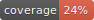
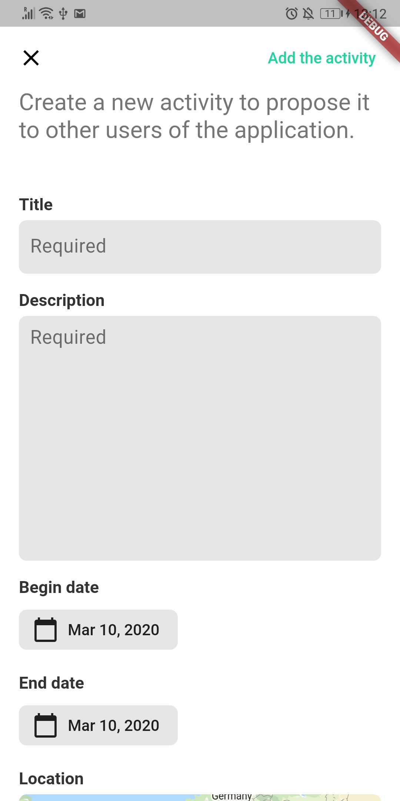

 
# Trare

Trare is a social network application for connecting travellers who want to do activities with other people (have a drink, go hiking, play a board game, etc).

## Where are we now?
- [x] User account : sign in, sign out, edit profile, delete profile, visualization
- [x] Explore activities
- [x] View an activity
- [x] Add new activities

<table style="border: none;">
<tr><td>

</td><td>

</td>

<td>

</td></tr>
<tr><td>

</td><td>

</td>

<td>

</td></tr>
<tr><td>

</td><td>

</td>

<td>

</td>
</td></tr>
<tr><td>

</td><td>

</td>

<td>

</td>
</td></tr>
</table>

## What's next ?

- [ ] Add photo to the user profile
- [ ] System for connecting users (activity chats, "I'm interested" button)
- [ ] Ability to change the activity search parameters (radius, position)

## How to contribute ?
- Make sure to read the contributing guide: [`CONTIBUTING.md`](CONTRIBUTING.md)
- Assign yourself an issue or create a new one. Each question of the current sprint is listed in the corresponding [Github Project](https://github.com/Romain-Guillot/Trare/projects) (Kanban board)
- Move your issue in the **WIP** column and resolve your issue
- Close the issue (it will automatically move the issue in the Done column)

**Preferably resolve one issue per commit.** It's easier for code review.

## How to install it ?
There are two ways to install and use the project, either you just want to download the application to your phone (simpler), or you want to build the application from the source code (more complicated).

We do not yet support iOS because we don't have a Mac or an iPhone to build and test the application.

### 1. Use the application directly (Android)

To use the application on your smartphone you need to download the `.apk` file on your smartphone.

> Android Package (APK)[1] is the package file format used by the Android operating system for distribution and installation of mobile apps, mobile games and middleware.
> **Wikipedia**

Go to [the latest releases](https://github.com/Romain-Guillot/Trare/releases) and download the `.apk` file and open it on your smartphone. It will launch the default installation procedure.

**For this, you will need to have previously authorized the installation of the application from unknown sources - [tutorial](https://www.androidauthority.com/how-to-install-apks-31494/)**

### 2. Build the application on your computer
Build the application directly from the source code is more complicated because to use some services (Firebase, Maps, Facebook Auth) the application HAS to be signed with an autorized certificate (that you don't have)

1. First, you need to set-up your environment
    1. [Install Flutter](https://flutter.dev/docs/get-started/install)
    1. [Set up an editor](https://flutter.dev/docs/get-started/editor?tab=vscode)
1. Download the code source (clone or download directly the archive file)
1. Send us a request with the [SHA1 signature of your PC](https://developers.google.com/android/guides/client-auth) for us to add it as a trust signature.

You can also set up your own services (Firebase, Google Maps and Facebook Auth). In this case you'll need to
1. modify the `app > android > app > google_services.json` file to include your Google services (with the following services to enable : Firestore, Google Authentication, Facebook Authentication, Firebase Storage)
2. Update the Google Map SQK API Key in the `app > android > app > src > main > AndroidManifest.xml` with your own key
3. Finally, update the keys in `app > android > app > src > main > res > values > string.xml` for the Facebook authentication with your own keys

## How to use it ?

The application can be used like many other applications. When you open it you will have to log in to access the different features.

<!-- eof -->
