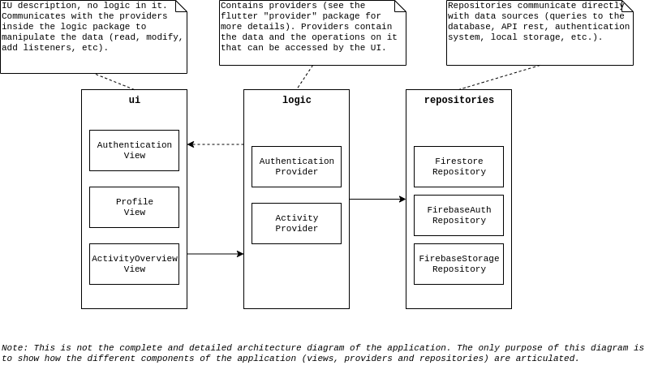

# #1 : Architecture

## Côté client

Voici le schéma d'architecture globale côté client :

Concrétement, `ui`, `logic` et `repositories` sont des dossiers (packages). `logic` et `repositories` contiendront sûrement uniquement des fichiers (assez peu nombreux au final). Par contre, `ui` sera sans doute séparé en plusieurs sous-dossier, le nombre de widgets pouvant être assez importants, il sera nécessaire de créer des sous-dossiers afin de mieux les organiser.

## Côté serveur

Nous utiliseront les services Firebase suivants pour gérer nos données :
- **Firebase Authentication:** "Manage your users in a simple and secure way. Firebase Auth offers multiple methods to authenticate, including email and password, third-party providers like Google or Facebook.";
- **Cloud Firestore:** Store and sync data between users and devices - at global scale - using a cloud-hosted, NoSQL database. Cloud Firestore gives you live synchronization and offline support along with efficient data queries.
- **Cloud Storage:** Store and share user-generated content like images, audio, and video with powerful, simple, and cost-effective object storage built for Google scale. The Firebase SDKs for Cloud Storage add Google security to file uploads and downloads for your Firebase apps, regardless of network quality.

Note: nous avons uniquement besoin de **Firebase Authentication** pour le itération #1, nous définirons donc la structure de nos données (de la BDD Cloud Firestore et des fichiers de Cloud Storage) lors d'une prochain itération.

## Références
- [Firebase products](https://firebase.google.com/products)
