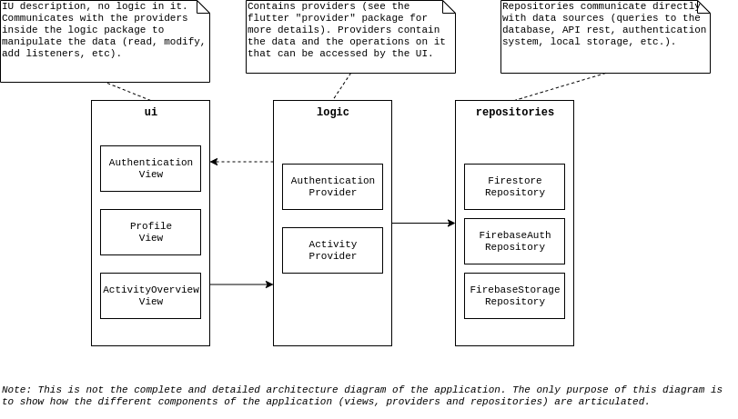

# Architecture : Architecture application client

Voici le schéma d'architecture globale côté client :

Concrétement, `ui`, `logic` et `repositories` sont des dossiers (packages). `logic` et `repositories` contiendront sûrement uniquement des fichiers (assez peu nombreux au final). Par contre, `ui` sera sans doute séparé en plusieurs sous-dossier, le nombre de widgets pouvant être assez importants, il sera nécessaire de créer des sous-dossiers afin de mieux les organiser.
