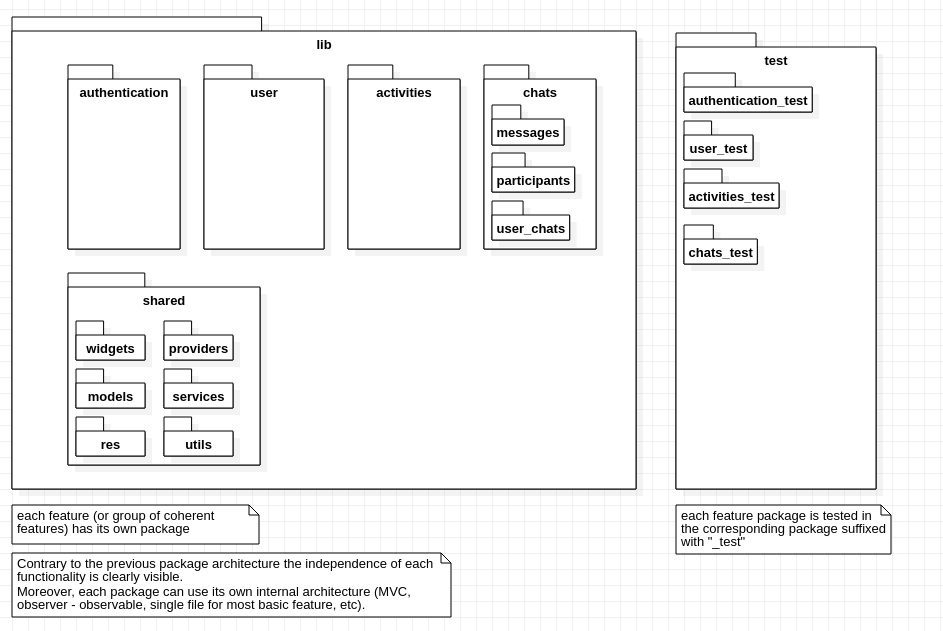
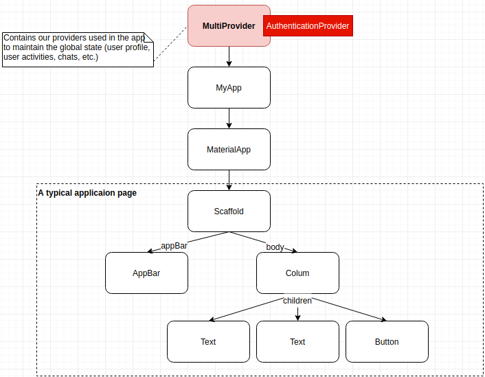
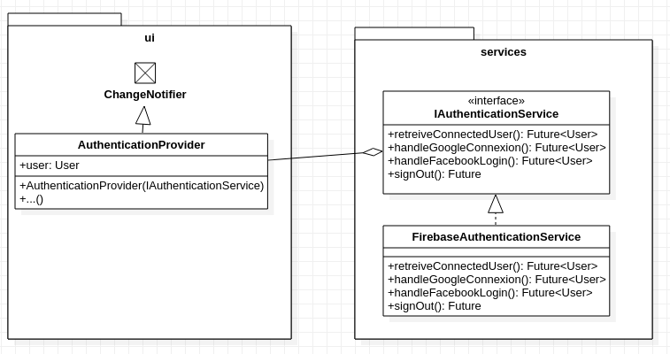

# Architecture : client-side
*Dernière modification : 29 mar 2020*

## Technologies

Nous avons choisi de developper notre application avec **Flutter**, un framework open source developpé par Google (et par la communauté !).

Voici les raisons qui nous ont menées à chosir **Flutter** :
- **Popularité :** Flutter est un framework activement soutenu par sa communauté, avec de nombreuses resources nous permettant de nous documenter (voir à titre d'illustraction la figure ci-dessous)
- **Cross-platform :** permet le developpement sur Android et iOS avec le même *code base* (et aussi Web, Desktop en version bêta)
- **Rapidité de developpement** : Flutter se base sur le langage de programmation *Dart*. C'est un langage qui permet la compilation AOT (Ahead of time) et JIT (Just in time). Lors de developpement l'application est compilé JIT et tourne dans une machine virtuelle pour permettre d'appliquer les changements très rapidement. La version finale, elle, est compilé AOT en langage natif (x64/ARM) pour améliorer les performances et réduire la taille de l'application.
- **La philosophie** : Flutter utilise le *declarative style* pour developper les interface graphique où tout est widget, programmer de cette manière est très appréciable selon nous
- **Framework récent (mais mature)** : Flutter est un framework récent basé sur un langage récent, les architectes / ingénieurs ont donc fait des choix permettant de facilement produire du code clair, bien structuré, suivants des principes de conception élégants

|  | First release date | Stars (Github)  | Contributors | # questions on Stackoverflow
---|---|---|---|---
[Flutter](https://github.com/flutter/flutter) | Dec 4th, 2018 | 86.6k | 530 | 34k
[React Native](https://github.com/facebook/react-native) | Jan 28, 2015 | 84.k | 2000 | 67k
*Date: Feb 12, 2020*

## Architecture

Voici le diagramme de package côté client :

### Architecture interne des fonctionnalités recommandée
Avec cette architecture des packages, chaque feature peut avoir sa propre architecture interne. Cependant, nous recommandons d'utiliser l'architecture **UI-Provider-Service** (c'est l'architecture utilisé par toutes les fonctionnalités à ce jour).
With this architecture, each feature can chose its own architecture. Moreover, it is recommended to use the  architecture.

###### UI
Les widgets  permettant de définir l'interface graphique. Communique avec les providers.

Typiquement voici un arbre représentant une page de notre application :

Les providers sont définis tout en haut de l'arbre, et donc accessible par les enfants.

*Note: un provider n'est pas obligé d'être déclarer à la racine de l'arbre ! Mais dans ce cas il faut faire attention à son cycle de vie (il sera reconstruit à chaque fois que le widget sera reconstruit)*

###### Logic
Contient nos providers permettant de gérer l'état **global** d'une fonctionnalité. Ils sont en général définis à la création de l'application (*pas forcément créé à ce moment là, ils seront créés uniquement lorsque quelqu'un en aura besoin : lazy providers)*.

La plupart du temps ils extendront la classe `ChangeNotifier` pour notifier les clients (observer/observable pattern) :
> A class that can be extended or mixed in that provides a change notification API using VoidCallback for notifications.

###### Services

Permettent la communication avec les source de données (database, local storage) ou avec les fonctionnalité de l'appareil (sensors, etc.)

Voici un diagramme de classe montrant l'architecture actuelle avec l'`AuthenticationProvider` et le service permetant l'authentification. Les providers ont connaissance des services via leurs interfaces, et sont injectés dans le constructeur (IoC)

### Ancienne architecture

Voici l'ancien diagramme de package utilisé au début :

**Raisons de changement :** L'indépendance des fonctionnalité n'était pas clair avec ce package. De plus, avec l'augmentation du nombre de fonctionnalité, les packages devenaient gros (beaucoup de fichiers), c'était difficile de savoir qui utilisait quoi.

<!--  -->
