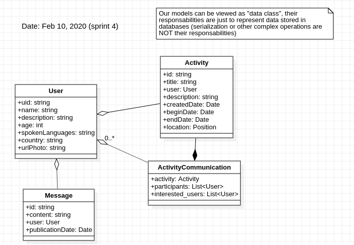

# Architecture : Modèles
*Dernière modification : 12 fev 2020*

Voici le diagramme de classe à jour avec le **sprint#4** (le système de messagerie n'est pas encore spécifié, les classes `ActivityChat` et `Message` sont donc à l'état de suppositions pour l'instant)

## User

Propriétés | Contraintes | Remarques
---|---|---
username | 6 < len < 40 |
age | 18 < value < 100 |
description | 20 < len < 500 |
langues parlées | len < 100 |
pays | len < 50 |  
photos |  |  

## Activité

Propriétés | Contraintes | Remarques
---|---|---
date de création | | utile principalement pour le tri
titre | 6 < len < 50 |
utilisateur |  | l'utilisateur proposant l'activité
description | 20 < len < 500 |
date de début | > date de création |  date à partir de laquelle l'utilisateur est disponible pour l'activité
date de fin | > date de fin | date limite jusqu'à laquelle l'utilisateur n'est plus disponible pour effectué l'activité
localisation | | localisation approximative de l'activités, des coordonnées GPS afin de pouvoir utiliser la position dans des algorithmes *de proximité*
