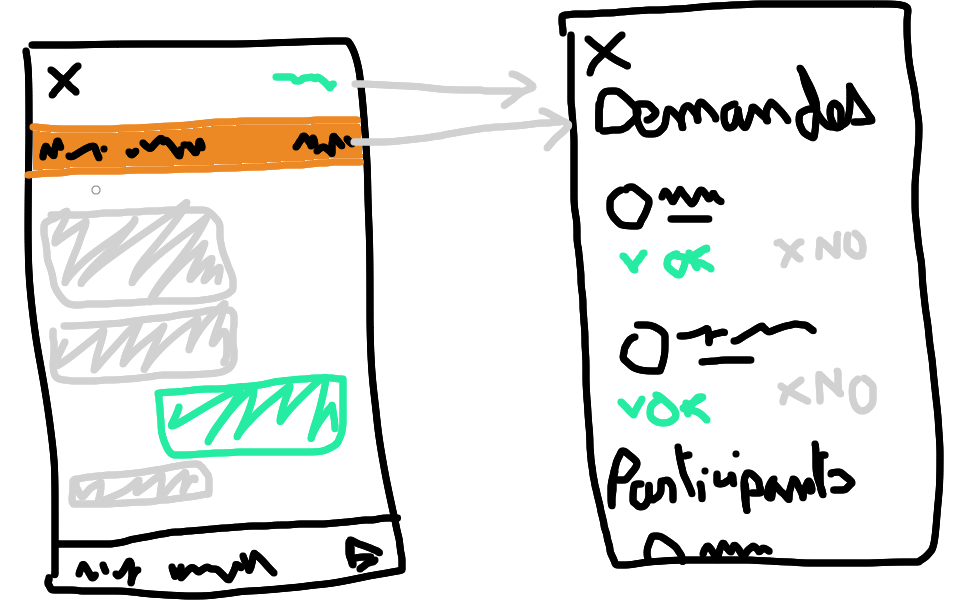

# Système de communication associé à une activité
*Dernière modification : 29 mar 2020*

Les activités seront associées à un **système de communication** pour mettre en contact les utilisateurs.

On considère 3 groupes d'utilisateur :
- **Le créateur :** l'utilisateur ayant créé l'activité
- **Les intéressés :** les utilisateurs voulant participer à l'activité
- **Les participants :** les utilisateurs participant à l'activité

Le système de communication consiste en une liste de **messages** envoyer par les participants et/ou le créateur. Ces messages peuvent être vu uniquement par les participants et/ou le créateur.

Pour pouvoir accécer à ce système de communication un utilisateur pourra demander à participer à l'activité, il fera donc parti du groupe des intéressés. Le créateur de l'activité pourra alors soit :
- **Accepter** la demande, l'utilisateur deviendra alors un participants
- **Ignorer** cette demande

Pour demander à participer à l'activité celle-ci ne doit pas être terminé (date de fin inférieure à la date actuelle).  

Le créateur, les intéressés et les participants pourront acceder à ce système de communication via une liste dans l'onglet "Chats". Voici les droits de visibilités des différents éléments :

| Élément      | Créateur | Participants | Intéressés |
| ------------ | -------- | ------------ |------------|
| Messages     | ✔️        | ✔️            | ❌         |
| Participants | ✔️        | ✔️            | ❌         |
| Demandes     | ✔️        | ❌           | ❌         |

Les intéressés n'ont accès à aucune info, un message d'attente sera affiché (*ex: "en attente de la réponse de ..."*)

> - bouton dans l'app bar : "details" ou "participants"
> - le bandeau orange est une indication visible par le créateur pour indiquer qu'il y a des demandes de participations
> - les demandes sont visibles uniquement par le créateur
