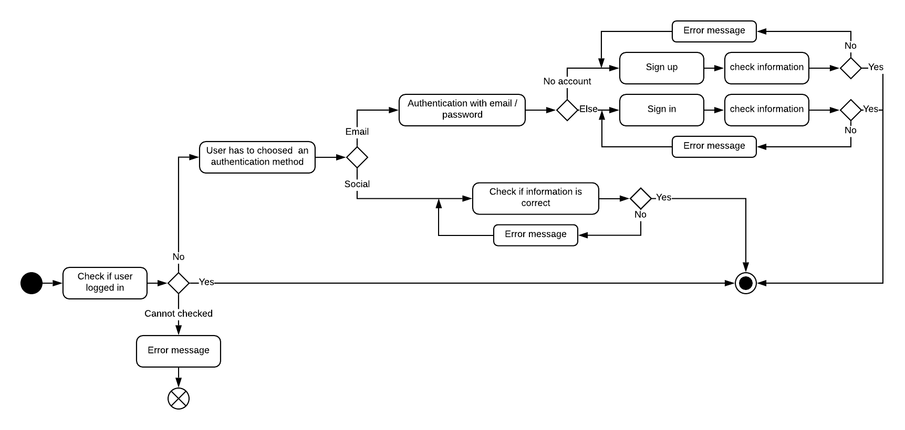

# Fonctionnalité : Authentification
*Dernière modification : 8 fev 2020*

## Objectifs
L'objectif de cette semaine est d'implémenter l'authentification au sein de l'application. Toutes les fonctionnalités sont uniquement accessibles aux utilisateurs connectés sur l'application, cette fonctionnalité est donc primoridiale.

## Détails
Le processus d'authentification contient les deux aspects suivants :
- vérifier si l'utilisateur est connecté;
- proposer à l'utilisateur de s'authentifier (s'il ne l'est pas).

Deux méthodes d'authentification sont condidérées :
- L'approche traditionnelle via email / mot de passe (plus longue, plus pénible pour l'utilisateur);
- Grâce aux réseaux sociaux tels que *Google* ou *Facebook*. Cette méthode est rapide (une seule action de l'utilisateur) et non contraignante pour la plupart des utilisateurs, elle est donc à privilégier.

L'approche grâce aux réseaux sociaux ne fait pas la différence entre *connexion* et *inscription*. *Firebase* se charge de créer le compte utilisateur s'il n'existe pas déjà. Par contre, l'approche traditionnelle doit prendre en compte cette différence. Si l'utilisateur choisi la méthode traditionnelle il aura donc le choix entre s'identifier directement ou créer un nouveau compte.

Bien-sûr, si le processus d'authentification échoue, l'utilisateur devra en être informer et sera inviter à retenter son action (si possible). Voici différent scénarios d'échecs :
- Impossible de vérifier si l'utilisateur est connecté ou non (impossible de communique avec *Firebase* par exemple);
- Une erreur est survenue lors de la vérification des informations de l'utilisateur (inscription avec email déjà existant, mot de passe trop faible, adresse mail incorrecte, etc.).

## Diagramme d'activités

Voici le diagramme d'activités récapitulant le processus d'authentification d'un utilisateur :

