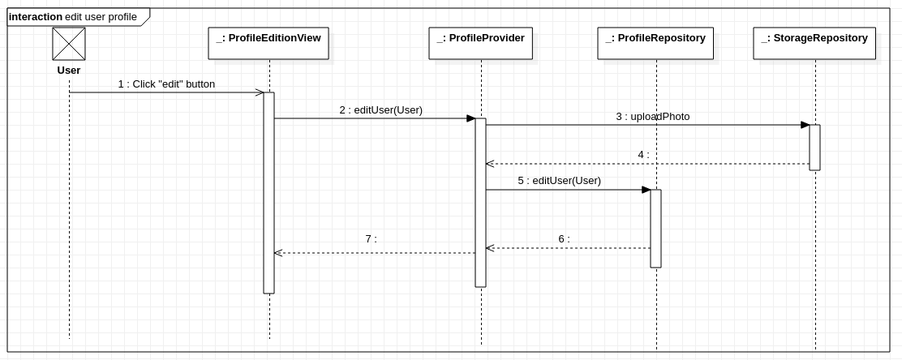

# Fonctionnalité : Profil utilisateur

Voici les éléments que composent le profil utilisateur :
- Nom d'utilisateur (texte libre, 1 ligne)
- Age (nombre)
- Description (texte libre, multi lignes)
- Pays (texte libre, 1 ligne)
- Langues parlées (texte libre, 1 ligne)
- Photo

## Visualisation

Consiste à créer la visualisation du profil utilisateur avec les éléments ci-dessus.

Doit proposer un bouton pour se deconnecter.  
Doit proposer un bouton pour se deconnecter.
Doit proposer un bouton pour éditer son profil (voir ci-dessous).

## Edition

Consiste à créer une formulaire pour éditer son profil utilisateur.  

Doit respecter les contraintes des différents éléments.  
Les champs doivent être pré-remplies avec les informations courantes de l'utilisateur.

Selon l'architecture du projet, voici le diagramme de séquence pour mettre à jour le profil de l'utilisateur:

## Références

Voir `archi_firebase.md` pour les détails *côté serveur* (stockage des données, photo).
