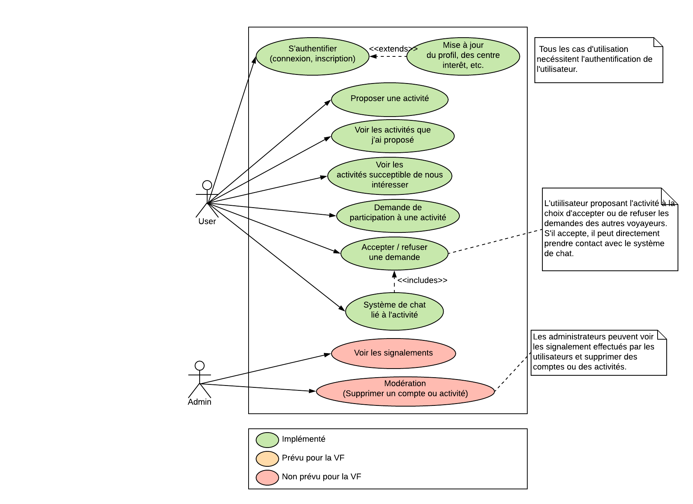

# Description de l'application

Le projet à pour but de développer une application mobile multiplateforme (Android et iOS) permettant de mettre en relation des voyageurs se trouvant à proximité ayant des intérêts communs à faire des activités ensemble (ex : boire une bière dans un bar, faire une randonnée, aller en club, visiter un musée, etc.).

Étant nous même voyageurs nous avons déjà eu ce besoin mais nous n’avons trouvé aucun service répondant à cette problématique.

