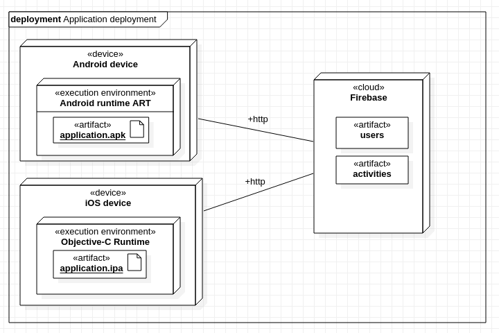

# Déploiement

Voici le diagramme UML de deploiement :

La phase du *build* nous génère un fichier `.apk` pour être exécuté sur l'*Android Runtime environment* sur les appareils Android. À terme, cette phase de *build* générera aussi un fichier `.ipa` pour les appareils iOS.

L'application générée communique avec les serveurs Firebase pour accéder aux données / services.
