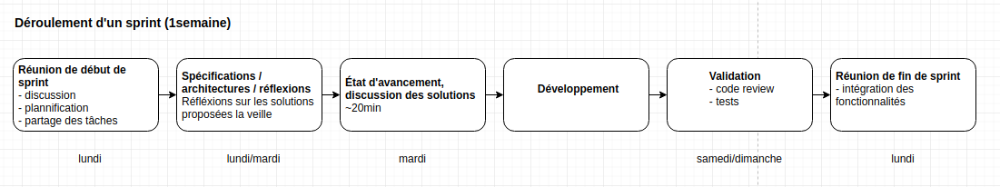
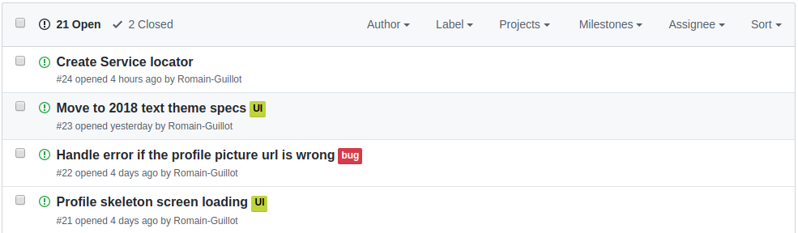

# Processus de travail

## Processus
On s'est inspiré d'un processus agile pour notre processus de travail.

Voici le déroulement d'un sprint sur une semaine :

On commence la semaine par un réunion le lundi pour discuter de la future fonctionnalité à developper (description, pistes de solutions, designs, etc.). Nous réfléchissons à cette fonctionnalité avant le cours du mardi. Mardi on fait un court briefing pour discuter de nos solutions.

Puis, on passe à la phase de développement pour implémenter la fonctionnalité. En fin de semaine nous validons le travail de l'autre (idéalement via des pull requests). Une fois la fonctionnalité validée, nous l'intégrons à la branche `master` de notre git lors de la réunion de fin de sprint le lundi.  

## Outils

###### Git et Github
Pour sprint, on créé des nouvelles branches :
- une branche stable dédiée au sprint (ex: `sprint1` pour le 1er sprint)
- deux branches de travail (ex: `sprint1_dev_dioulde` pour la branche de Diouldé)

À la fin du sprint, la branche dédiée au sprint courant est mergée sur la branche stable `master`.

On utilise les [Pull Request](https://help.github.com/en/github/collaborating-with-issues-and-pull-requests/about-pull-requests) de Github pour valider le code en fin de fonctionnalité.

On utilise le système d'[Issues](https://help.github.com/en/github/managing-your-work-on-github/about-issues) de Github, pour y repertorier les bugs / améliorations à faire.

###### CodeMagic

[CodeMagic](https://codemagic.io/start/) est un outils de CI/CD (Continuous integration / continuous delivery) qui nous permet d'automatiser le *build*, le test et le deploiement de l'application.

On a configuré un *workflow* pour pemettre de *build*, test et deploiement l'application sur le Play Store (pour les internal testers) à chaque *push* sur la branche `master`. L'artifact généré nous est envoyé par mail (pour l'instant uniquement un `.apk` pour la plateforme Android).

###### Discord

Discord est notre moyen de communication avec plusieurs cannaux pour se partager diverses informations.

<!--  -->
