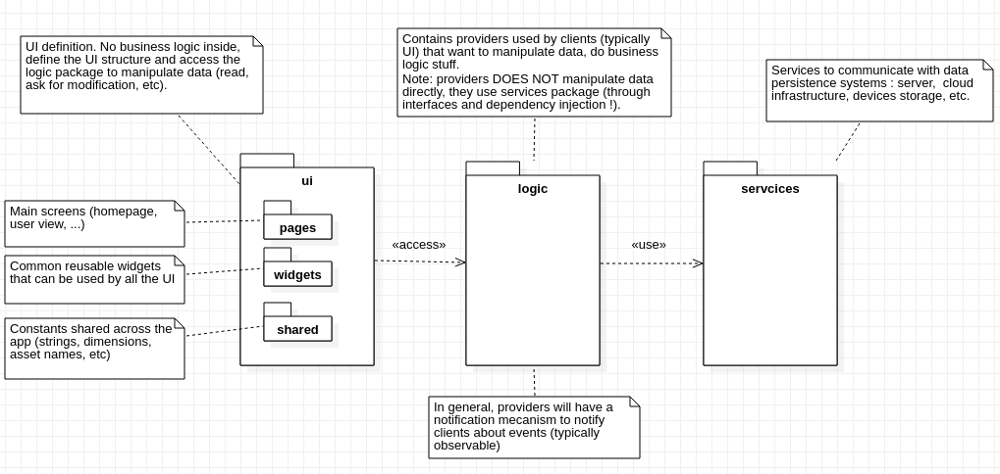
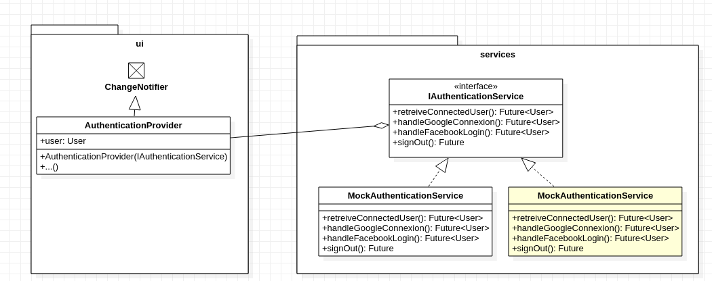

*Dernière modification : 13 mar 2020*

# Tests (unit, integration, UI)

## Introduction

Nous considérons 3 types de tests pour tester notre application :
- **Unit test** : test unitaire pour tester une méthode ou une classe
- **Widget test** : test lié à l'UI (aux widgets) pour vérifier le bon fonctionnement d'un widget (ce qu'il affiche, dans quelles conditions, etc.)
- **Integration test** : test une plus large partie de l'application (pas seulement un élément isolé mais plus globalement une fonctionnalité)

## Comment tester notre application ?

L'architecture utilisé pour le projet permet de facilement tester les différentes parties de l'application puisque le prince de *Separation Of Concerns* a bien été appliqué :

- Le package `ui` contient tous les widgets de l'application, cette partie doit être testée avec des *widget tests* ;
- Le package `logic` contient le business logic de l'application (son comportement), cette partie doit être testée avec des *unit tests* ;
- La package

## Mocking

> Mocking is a way of simulating parts of your app that are outside the scope of the test so that they behave in a specific way. Using mocking in your unit tests prevents tests from failing for reasons other than a flaw in your code, like an unstable network
> **Source : [raywenderlich.com](https://www.raywenderlich.com/6926998-unit-testing-with-flutter-getting-started)**

Donc, pour écrire nos tests unitaires, sachant que nos providers (business logic) dépendent des services, nous devront créer des mock services qui étendent des interfaces définissant nos services.

## Références
- [Flutter - Testing Flutter apps](https://flutter.dev/docs/testing)
- [Unit Testing With Flutter: Getting Started](https://www.raywenderlich.com/6926998-unit-testing-with-flutter-getting-started)
