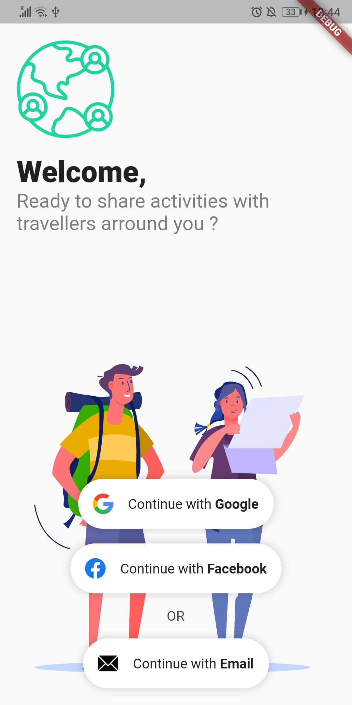

# Planning : Sprint 1

## Planning
**Durée​ :** 1ère semaine (du 20 au 26 janvier)
**Objectifs​ :**
- [x] Mise en place de notre environnement de travail (Git, environnment de travail, système de communication, etc.);
- [x] Mise en place du projet Firebase (côté serveur);
- [x] Choix d’architecture côté client;
- [x] Développement de la fonctionnalité d’authentification (spéfication, implémentation et tests).

## Résulats

###### Environnement de travail
- Système de versionning **Git** + hébergement sur **Github**.  
- Environnement de travail : Flutter, Dart, Android SDK, IDE (vscode).  
- Outils de *continuous integration* et *continuous delivery* : [CodeMagic](https://codemagic.io/start/). Configuration pour automatiser la phase de test + la phase de build automatiquement lors de *push* sur la master origin.  

###### Projet Firebase
- Création du projet Firebase
- Activation du service **Firebase Authentication** avec Google, Facebook, mail/psswd
- Configuration des nos environnement de travail dessus (signature SHA)

###### Architecture client

Voir `archi_appclient.md`.

###### Authentification

Voir `feature_authentification.md`

- Spécification
- Boutons d'authentification (UI) : Google, Facebook, Email ;
- Provider qui communique avec le service et notifie l'UI;
- Service qui permet l'authentification avec Google et Facebook

## TODO
- **TODO:** Authentification (connexion / inscription) via email / mot de passe [Issue#3](https://github.com/Romain-Guillot/UQAC-GL-Projet/issues/3)
- **TODO:** configuration de la phase de deploiement sur Google Play. [Issue#8](https://github.com/Romain-Guillot/UQAC-GL-Projet/issues/8) - [Issue#9](https://github.com/Romain-Guillot/UQAC-GL-Projet/issues/9)

<!--  -->
