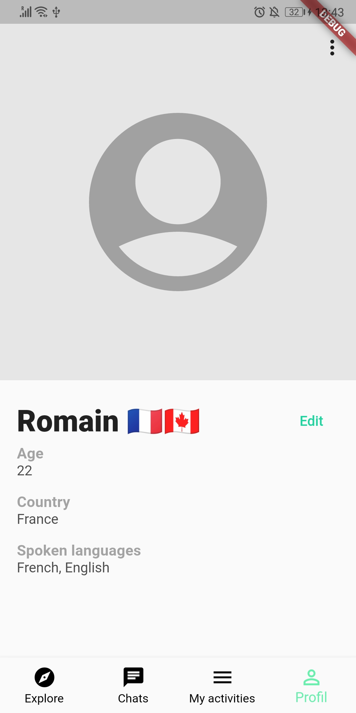
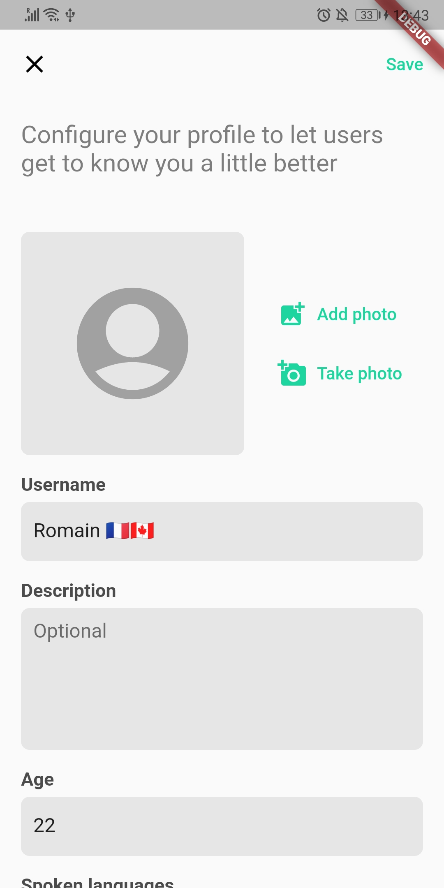

# Planning : Sprint 2

## Planning
**Durée:** 2ème semaine (du 27 au 2 février)  
**Objectifs:**
- [x] Mise en place de la BDD (configuration + structure)
- [x] Spécification profil utilisateur (visualisation + édition)
- [x] Renseignement du profil utilisateur:
    - [x] Formulaire (photo, nom d'utilisateur, age, description, langues parlées, pays)
    - [x] Visualisation du profil

## Résulats

###### Mise en place de la BDD (configuration + structure)
Voir `archi_firebase.md`.

- Création de la BDD Cloud Firestore
- Strucutre des données
- Règles de sécurités

###### Renseignement du profil utilisateur:
Voir `archi_models.md`
Voir `feature_profilutilisateur.md`.

- Spécification du modèle "User"
- Spécifications des fonctionnalités de visualisation et d'édition
- Service : service permettant de récupérer les informations de l'utilisateur et de les modifier
- Provider : provider permettant de communiquer avec le service du profil et de notifier l'UI
- UI : affichage du profil utilisateur
- UI : formulaire d'édition du profil

<table style="border: none;">
<tr><td>

</td><td>

</td></tr>
</table>

## TODO

- **TODO:** Photo de profil (upload / modification) [Issue#12](https://github.com/Romain-Guillot/UQAC-GL-Projet/issues/12)
- **TODO:** Bouton de suppression du compte [Issue#14](https://github.com/Romain-Guillot/UQAC-GL-Projet/issues/14)

<!--  -->
