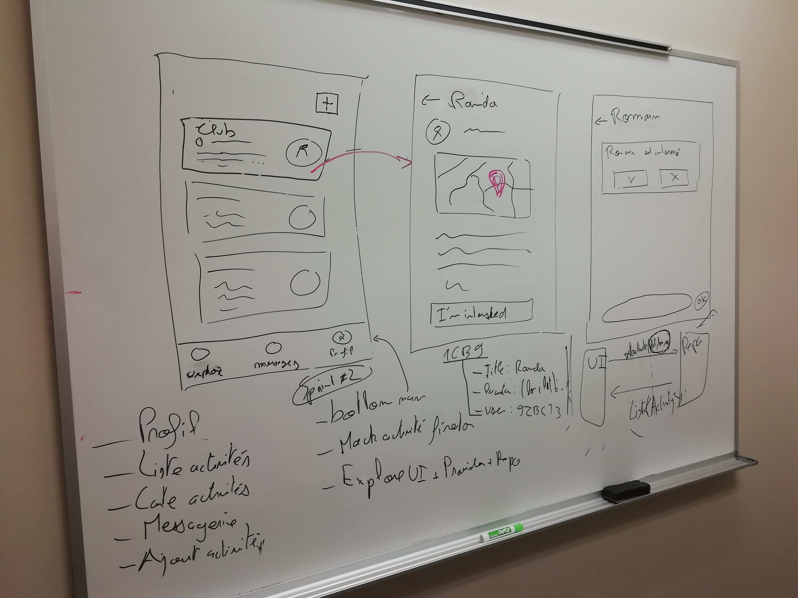

# Planning : Sprint 3

## Planning

**Durée:** 3ème semaine (du 3 au 9 février)  
**Objectifs:**
- [x] Layout global de l'application (BottomNavBar)
- [x] Spécification de la page "Explore" + de la structure d'une activité
- [ ] **[WIP]** Page "Explore" (liste des activités à proximité)
    - Layout
    - Provider (avec données fictives)

## Résultats

###### Layout global de l'application (BottomNavBar)

*Bottom navigation bar* avec les onglets :
- Explore : liste d'activités
- Chats : conversion liées aux activités
- My activities : liste des activités proposées
- Profile : visualisation / édition du profil utilisateur

######  Page "Explore" + structure d'une activité
- Voir `archi_models.md`
- Voir `feature_explore.md`

- Spécification d'une activités
- Spécification de la page *Explore*
- Service : mock service pour récupérer des activités
- Provider : provider communiquant avec le repository et notify l'UI
- UI : [WIP] page explore

## TODO
- **WIP**: finir la page *Explore* (documentation, finitions)
