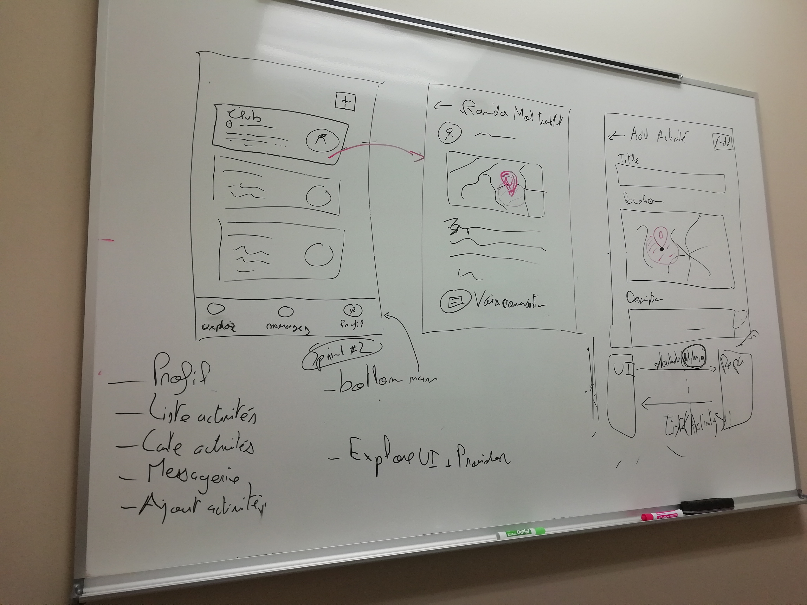

# Planning : Sprint 3

## Planning

**Durée:** 3ème semaine (du 3 au 9 février)  
**Objectifs:**
- Layout global de l'application (BottomNavBar)
- Spécification de la page "Explore" + de la structure d'une activité
- Page "Explore" (liste des activités à proximité)
    - Layout
    - Provider (avec données fictives)

## Résultats
