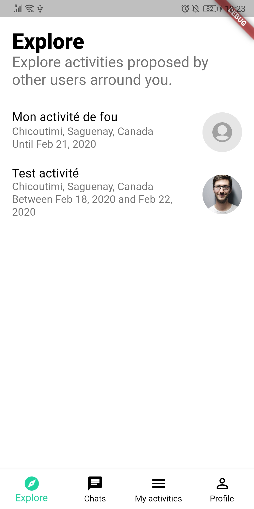
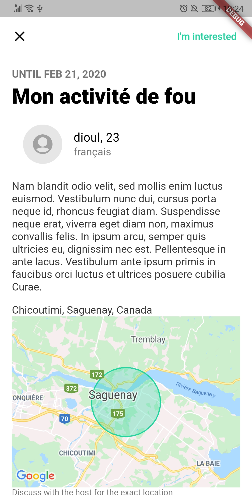
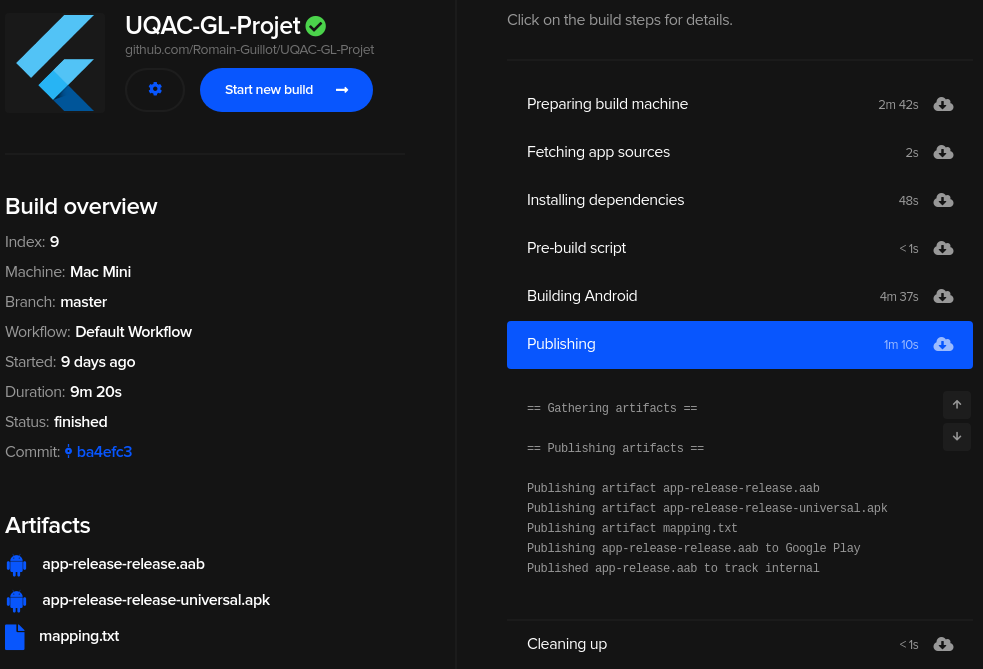

# Planning : Sprint 4

## Planning
**Durée:** 4ème semaine (du 10 au 17 février)  
**Objectifs:**
- [x] Remise préliminaire R1 : diagrammes non terminés (classes, component, deployment) + assembler tous les éléments dans un rapport
- [x] Finir *Explore* (UI)
- [x] Vue détaillée d'une activité (ActivityView)
- [x] Compléter le document d'architecture de la base de données `archi_firebase.md` avec le système d'activités
- [x] Remplacer l'implémentation `MockActivitiesService` par une implémentation utilisant Firebase (`FirestoreActivitiesService`)
- [x] Nom de l'application + configuration de CodeMagic (CI/CD) pour le deploiement automatiser sur le Play Store (pour les *internal testers*)

## Résultats

###### Remise préliminaire et documents
- [Remise préliminaire](https://github.com/Romain-Guillot/Trare/blob/master/documents/remises/PROJET_LOGICIEL_R1_Rapport.pdf)
- [Document d'architecture](https://github.com/Romain-Guillot/Trare/blob/master/documents/archi_client.md)

###### Explore et visualisation d'une activité

<table style="border: none;">
<tr><td>

</td><td>

</td></tr>
</table>

###### Deploiement automatisé sur la Play Store

