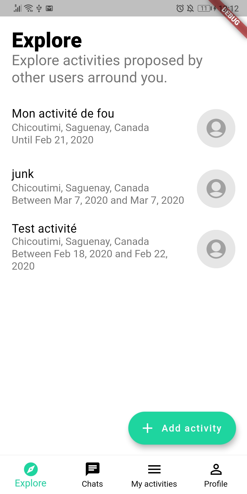
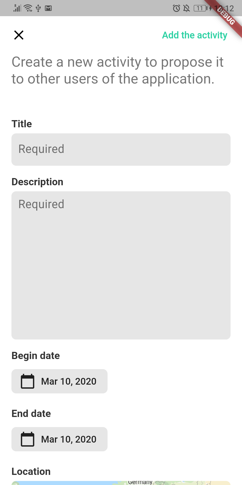
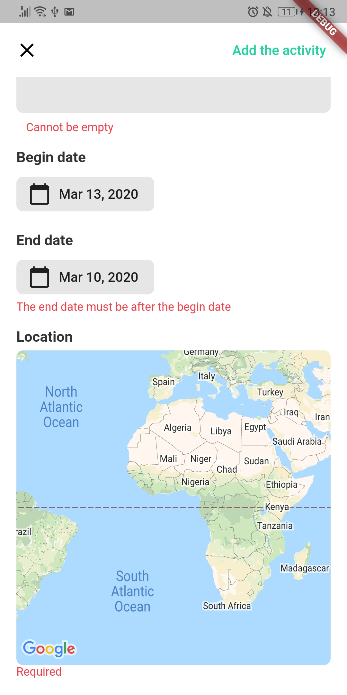

# Planning : Sprint 5

**CECI EST UN DOCUMENT DE DEBUT DE SPRINT ! IL N'EST PAS MIS A JOUR AVEC LES CHANGEMENTS EFFECTUES AU COURS DU DEVELOPPEMENT. VEUILLEZ VOSU REFERER AUX AUTRES DOCUMENTS QUI EUX SONT MIS A JOUR.**

## Planning
Pour ce sprint, nous avons légèrement modifié notre organisation d'interne de repartition des tâches : chaque tâche à effectué est maintenant repertorié par une issue et inclu dans un *Kandan board*.

**Durée:** 5ème et 6ème semaines (du 17 février au 02 mars)  
**Github *Kanban board*:** [lien](https://github.com/Romain-Guillot/Trare/projects/1)
**Objectif principal:** Implémenter le formulaire de création d'activité

## Résultats

L'insertion d'activité a été implémentée :
- Ajout du bouton d'insertion
- Ajout de l'UI d'insertion
- Ajout du business logic
- Ajout du service responsable d'insérer l'activité dans la BDD

<table style="border: none;">
<tr><td>

</td><td>

</td>

<td>

</td></tr>
</table>

*Bouton, formulaire, gestion des champs mal formatés*
